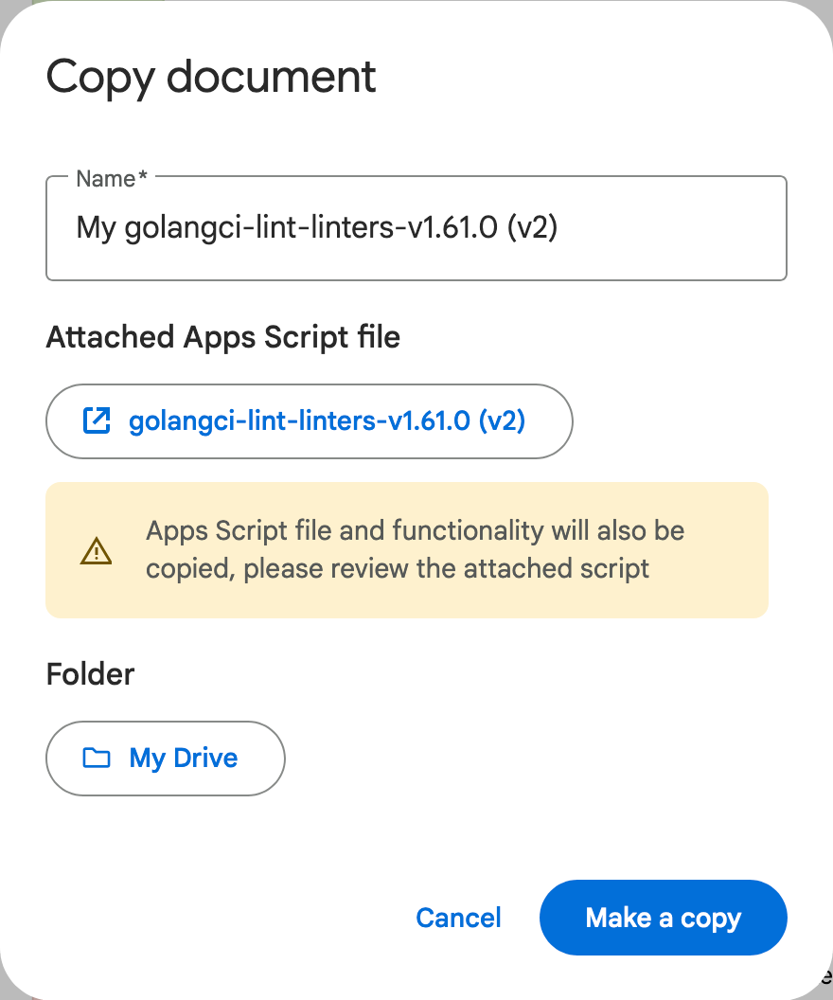
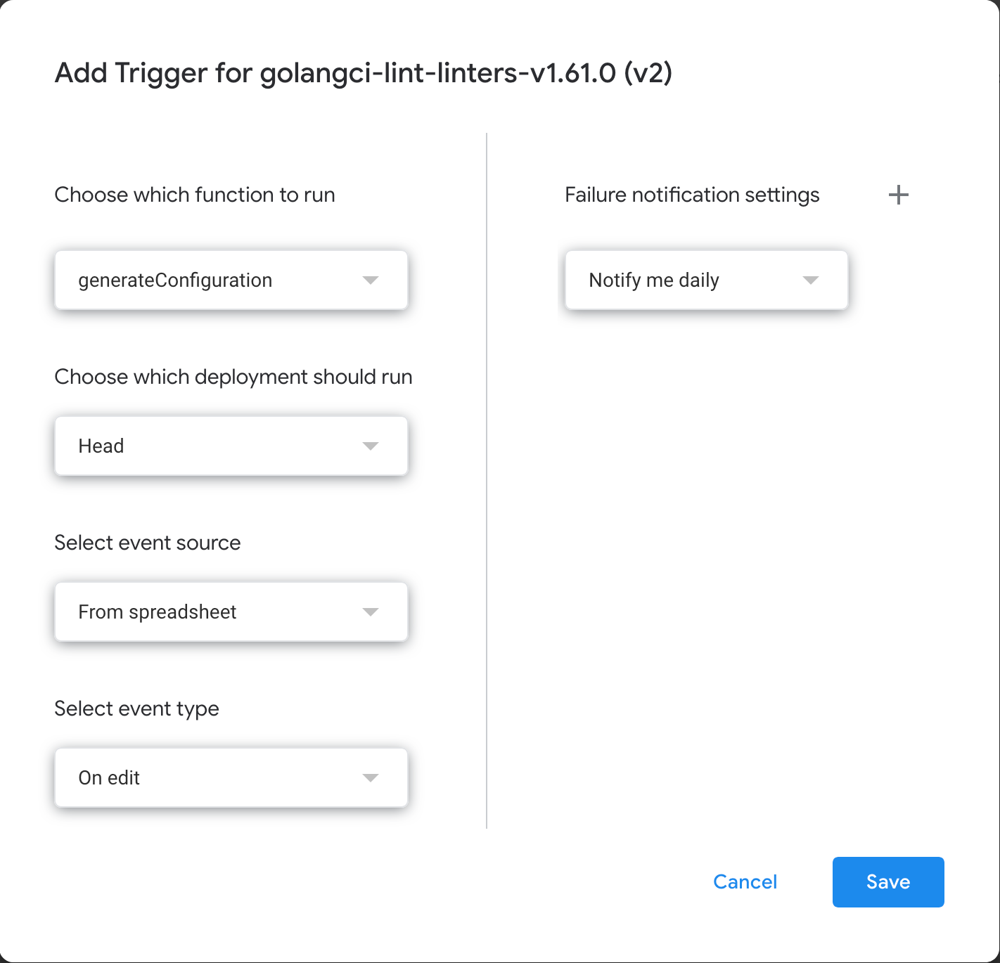
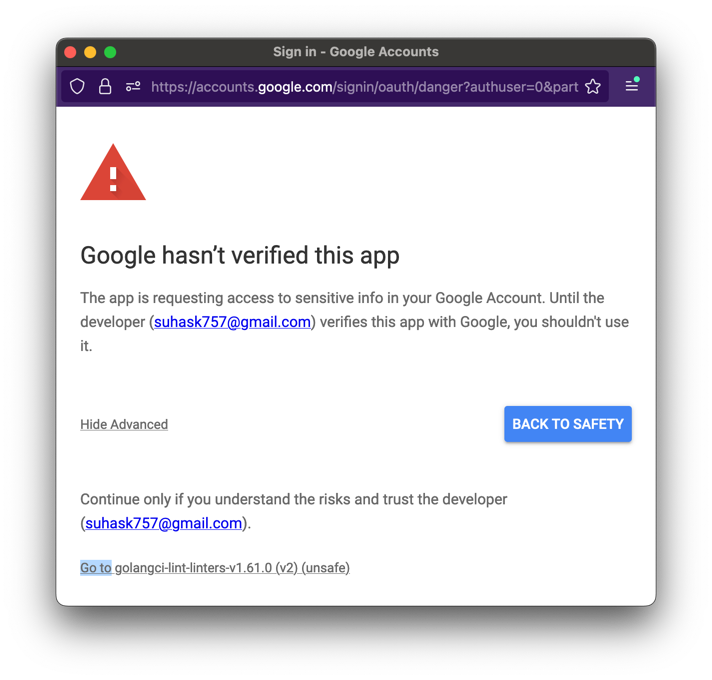

# Operationalising `golangci-lint` (v2)

Presentation slides and material for talk presented at Gophercon India 2024.

Ideally the slides should have been accessible
at https://go-talks.appspot.com/github.com/sudo-suhas/operationalising-golangci-lint-v2/2024-12-gophercon-india.slide.
However, due to https://github.com/golang/go/issues/58906, the functionality is currently broken.

As an alternative, the slides have been hosted via [Google App Engine][google-app-engine] and can be
accessed [here][app-engine-endpoint].

## Configuration sheet

[golangci-lint-linters-v1.61.0 sheet][golangci-lint-linters-v1-61-0-sheet]

This sheet helps to manage the configuration for `golangci-lint`. It can also help with generating
the 2 configuration files.

⚠️ The configuration was last updated for version `v1.61.0` of `golangci-lint`.

### `available-linters`

This sheet lists the linters that were available in version `v1.61.0` with the following columns:

- **Linter**: The name of the linter with a link to the source or website for it. If applicable,
  there is also a link to the golangci-lint’s documentation for configuring the linter. For
  example, https://staticcheck.io/ and https://golangci-lint.run/usage/linters/#staticcheck.
- **Description**: A short description of the linter.
- **Status**: This field indicates whether the linter is enabled or disabled.
- **Comments**: Self explanatory. The comments try to justify why a particular linter is enabled or
  disabled.
- **Settings**: If the linter is enabled, the value in this field is used to configure the linter.
  The settings are in TOML format. These settings are hand-coded with 2 exceptions. In case of
  `gocritic` and `revive`, the settings are generated from their respective sheets (explained
  below).

### `gocritic@v0.11.5`

This sheet lists the checks that were available in version `v0.11.5` of `gocritic` that was packaged
into `golangci-lint@v1.61.0`. The sheet is similar to the `available-linters` sheet and is used to
manage the 100+ checks provided by `gocritic`. The checks that are enabled along with their optional
settings are used to build the complete settings for `gocritic` in `golangci-lint`’s configuration.

📒 The function `BUILD_GOCRITIC_SETTINGS` is defined in the [Apps Script][google-apps-script] project
linked to the sheet.

### `revive@v1.4.0`

This sheet lists the checks that were available in version `v1.4.0` of `revive` that was packaged
into `golangci-lint@v1.61.0`. The sheet is similar to the `available-linters` sheet and is used to
manage the 77 checks provided by `revive`. The checks that are enabled along with their optional
settings are used to build the complete settings for `revive` in `golangci-lint`’s configuration.

📒 The function `BUILD_REVIVE_SETTINGS` is defined in the [Apps Script][google-apps-script] project
linked to the sheet.

### `sections`

This has the static header and footer for the generation of `golangci-lint` configuration.

### `.golangci.toml`

This has the configuration for `golangci-lint` generated by stitching together the following:

1. Header from the `sections` sheet.
2. Linters enabled in the `available-linters` sheet.
3. Linter settings for enabled linters in `available-linters` sheet.
4. Footer from the `sections` sheet.

The configuration is updated in a few seconds whenever any change is made in the sheet by
the [Apps Script][google-apps-script] project linked to the sheet.

⚠️ When the configuration is copied from the sheet, it is wrapped in double quotes. So we need to
replace `""` with `"` and remove the quotes at the beginning and the end.

### How to copy the configuration sheet

One way to use the sheet is to copy the generated configuration and modify as needed. However, if
you want to be able to edit the sheet and regenerate the configuration, follow the instructions
below.

<details>
<summary>Step by step instructions</summary>

[Make a copy][google-sheet-copy] of the sheet. This will copy over the apps script project as well:

<p align="center">
  
</p>

Open the apps script project via "Extensions > Apps Script". Open the triggers tab and create a new
trigger with the following settings:

<p align="center">
  
</p>

When you click "Save" it will ask you to authorise the apps script. This isn't an app verified by
Google so you will need to click "Advanced" and click "Go to golangci-lint-linters-v1.61.0 (v2) (
unsafe)"

<p align="center">
  
</p>

Finally click "Allow" to complete setting up the trigger. Now, whenever any cell in the sheet is
edited the configuration in `.golangci.toml` will be rebuilt.

</details>

### Why TOML?

[YAML: probably not so great after all][arp242-yaml-config]

## Integrating `golangci-lint` into an existing project

When we are creating a new project, it is straightforward to integrate `golangci-lint` into it.
However, if we are integrating `golangci-lint` into a pre-existing project where either the linter
was not integrated or the configuration was minimal, we need a strategy to iteratively fix the large
number of issues that would be reported by the linter with the new/updated configuration. Fixing all
the issues in a single effort can be inhibitively expensive. `golangci-lint` provides a mechanism
for doing so by reporting issues only for new and modified lines in the commit.
See [golangci-lint FAQ][golangci-lint-faq].

## Project tooling

Most repositories utilise multiple tools for formatting, code/doc generation and testing. Some
examples:

- `golangci-lint`: [github.com/golangci/golangci-lint][golangci-lint]
- `gofumpt`: [github.com/mvdan/gofumpt][gofumpt]
- `mockery`: [github.com/vektra/mockery][mockery]

The version of these tools needs to be kept consistent between local and CI. Sometimes the version
of these tools are different across projects and different developers might have different local
versions of these tools.

We can leverage Go modules to manage the necessary tooling by doing the following:

- Add a `go.mod` file under `tools` directory:
  ```shell
  go mod init github.com/netskope/spm-{{repo}}/tools
  ```
- Add a `tools.go` file in the same folder with a build constraint so that it does not get included
  in the build:
  ```go
  //go:build tools
  
  package tools
  
  import (
    _ "github.com/golangci/golangci-lint/cmd/golangci-lint"
    // add more imports as needed
  )
  ```
- Run `go mod tidy` to sync the `tools/go.mod` with the tools that are declared in `tools.go`.

Using the `tools/go.mod`, we can build the tool binaries. [Task][task] can be used for building the
binaries on demand and for managing the commonly used commands. Taskfile is a more modern
replacement for Makefiles and also has features for re-building the tools based on checksum of
module files. Taskfile example: [`Taskfile.yml`](Taskfile.yml)

## Developer workflow (with [Task][task])

### Installing task

To install task on macOS with Homebrew, following command needs to be executed:

```shell
brew install go-task
```

For other operating systems please refer [task installation page][task-installation].

### Install tools locally

Users can install and cache tools locally for formatting, linter checks etc. by using the below
command:

```shell
task install-tools
```

User can run `task --list` to list all configured commands for the current repository.

### Formatting code

Formatting issues can be reported by [`github.com/mvdan/gofumpt`][gofumpt]
and [`github.com/daixiang0/gci`][gci]. We just need to run `task fmt` to fix all formatting issues.
It is also possible to only fix the order of import statements by running `task imports`.

```
➜ task fmt
task: Task "install-gci" is up to date
task: Task "install-gofumpt" is up to date
task: [imports] .tools/gci write ./ --section standard --section default --section "Prefix(github.com/netskope,github.com/netSkope)" --skip-generated --skip-vendor
task: [fmt] .tools/gofumpt -l -w -extra .
```

By integrating the tools to the IDE, we can enable format on save so that files are always formatted
correctly.

### IDE configuration

#### Goland

##### Set up linter integration for the IDE:

- Install the [Go Linter][go-linter] plugin for GoLand.
- Under **Tools | Go Linter**, For the "Path to golangci-lint", select the `golangci-lint` binary
  present in the `.tools` directory inside the project (run `task install-tools` if binary is not
  present under `.tools`).

Go Linter should automatically pick `.golangci.toml` as the configuration file. It is recommended to
use this with the IDE plugin to avoid running some of the heavy linters like `unused` during
development. `task lint` can be used to lint the source files against `.golangci-prod.toml`.

##### Import the file watchers settings:

1. Open IDE preferences with `⌘` + `,`.
2. Navigate to the 'File Watchers' settings: **Tools | File Watchers**.
3. Click the 'Import' icon (![import icon][idea-import-icon]) and select the file
   [`.idea/watchers-cfg.xml`][watchers-cfg-xml]. _To show hidden folders in the Finder app on macOS,
   press `⌘` + `⇧` + `.`._

These file watchers will run `gci` and `gofumpt` for updating import lines and formatting the code
idiomatically on saving the file.

##### To avoid conflicts with some inbuilt formatting features, do the following:

- Under **Code Style | Go**:
- Select the "Imports" tab and set "Sorting type" to "None".
- Under the "Other" tab:
- Deselect "On Reformat Code action"
- Select "Add a leading space to comments". under "Except for comments starting with:" add `nolint`
  and `go:`.
- Under **Tools | Actions on Save**, deselect "Reformat Code".

### False Positives

False positives are inevitable but `golangci-lint` provides flexible mechanisms for working around
false positives. We can either use `//nolint` directives to ignore a specific error or we can update
the `.golangci-lint*.toml` and add an `exclude-rule`.
See https://golangci-lint.run/usage/false-positives/ for more details.

When adding or updating `exclude-rules`, remember to update both `.golangci.toml` and
`.golangci-prod.toml`.

[google-app-engine]: https://cloud.google.com/appengine

[app-engine-endpoint]: https://suhas-0.el.r.appspot.com/operationalising-golangci-lint-v2/2024-12-gophercon-india.slide

[golangci-lint-linters-v1-61-0-sheet]: https://docs.google.com/spreadsheets/d/1-pg0JNHOoN8bRer5bRuZFYYPpspYXdwe5wIKjglcvsE/edit?usp=sharing

[google-apps-script]: https://www.google.com/script/start/

[google-sheet-copy]: https://support.google.com/docs/answer/49114?hl=en&co=GENIE.Platform%3DDesktop#zippy=%2Cmake-a-copy-of-a-file

[arp242-yaml-config]: http://web.archive.org/web/20240527051649/https://www.arp242.net/yaml-config.html

[golangci-lint-faq]: https://golangci-lint.run/welcome/faq/#how-to-integrate-golangci-lint-into-large-project-with-thousands-of-issues

[golangci-lint]: github.com/golangci/golangci-lint

[gofumpt]: github.com/mvdan/gofumpt

[mockery]: github.com/vektra/mockery

[task]: https://taskfile.dev/

[taskfile]: https://github.com/sudo-suhas/operationalising-golangci-lint/blob/master/Taskfile.yml

[task-installation]: https://taskfile.dev/installation/

[gci]: https://github.com/daixiang0/gci

[go-linter]: https://plugins.jetbrains.com/plugin/12496-go-linter

[idea-import-icon]: https://resources.jetbrains.com/help/img/idea/2020.3/icons.toolbarDecorator.import_dark.svg

[watchers-cfg-xml]: ./.idea/watchers-cfg.xml